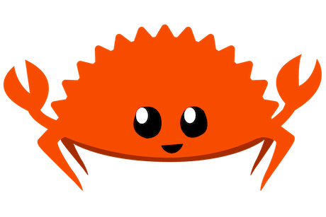
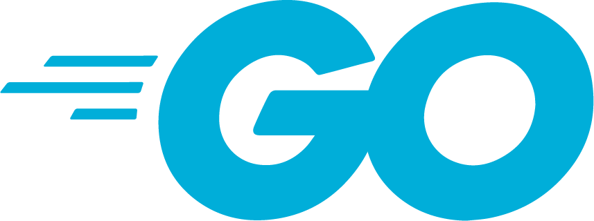

I am a computer scientist with a passion for mobile robotics and efficiency.

Here are some highlights:

## General
- [dev](https://github.com/stelzo/dev): My dev environment and dotfiles
- [ros-dev-setup](https://github.com/stelzo/ros-dev-setup): My ROS dev environment

## Robotics
- [minot](https://github.com/uos/minot) []: Tool for testing and debugging stateful ROS nodes
- [ros_pointcloud2](https://github.com/stelzo/ros_pointcloud2) []: Safe on-the-fly point cloud message conversions for ROS1 and ROS2
- [imu-calib-ros](https://github.com/stelzo/imu-calib-ros) []: Minimal ROS2 Package for intrinsic IMU calibration using gravity
- [cupcl-rs](https://github.com/stelzo/cupcl-rs) [, ]: Rust bindings for [cuPCL](https://github.com/NVIDIA-AI-IOT/cuPCL) and additional custom GPU filters

## dofusdude
A namespace for my tools and APIs helping the [Dofus](https://www.dofus.com) developer community.

- [doduda](https://github.com/dofusdude/doduda) []: CLI for downloading and unpacking Ankama games and denormalising game databases to usable jsons for use in other apps
- [doduapi](https://github.com/dofusdude/doduapi) []: RESTful API for the Dofus encyclopedia using GitHub Action chains and doduda
- [ankama-discord-hooks](https://github.com/dofusdude/ankama-discord-hooks) [, , , ]: Public Discord Webhooks CRUD API for updates related to the Ankama Kosmos using a generated SDK with [WebUI](https://discord.dofusdude.com)
- [api-docs](https://github.com/dofusdude/api-docs) [OpenAPI, GitHub Actions]: OpenAPI spec for all APIs with CI/CD for generating and publishing 5 SDKs on push
